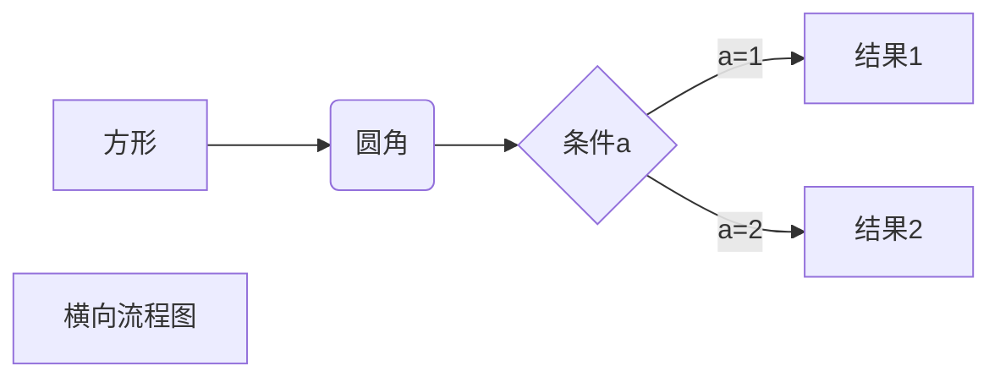
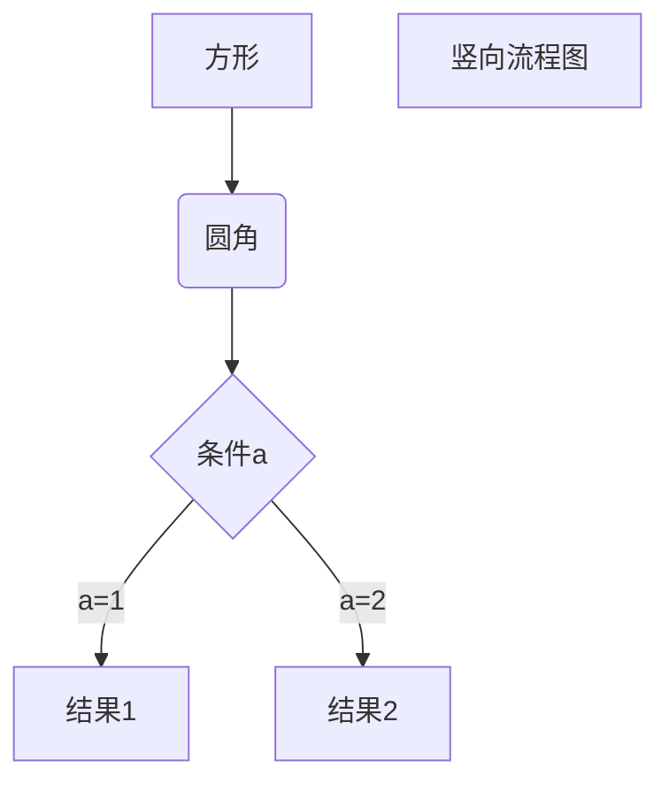
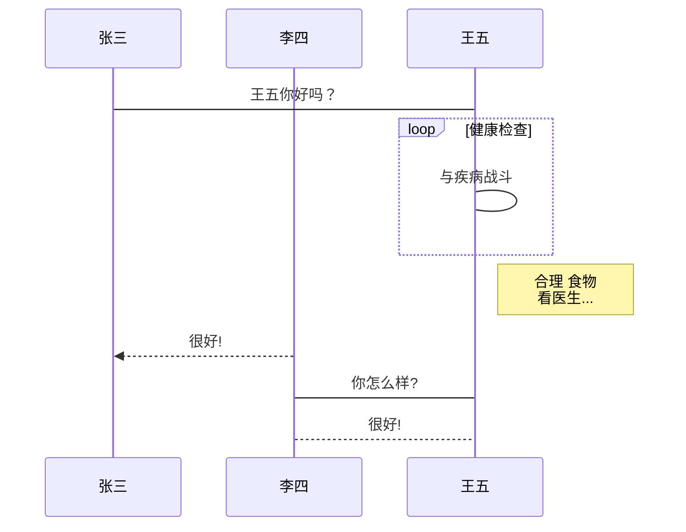
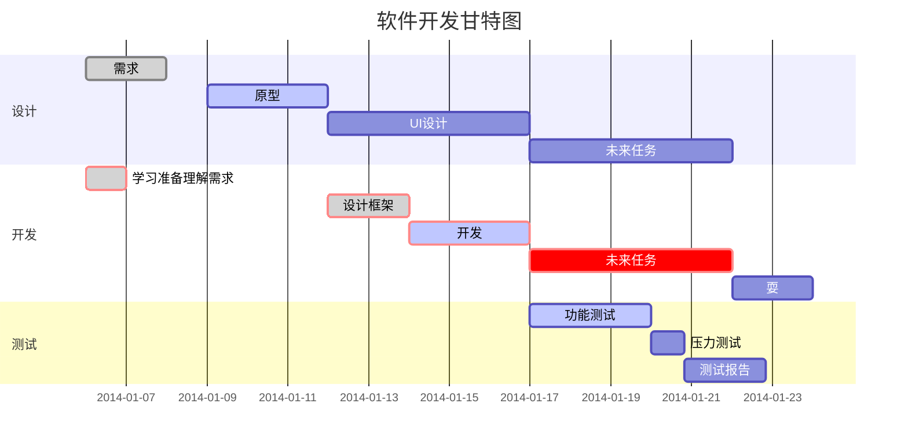

#

# 一、标题


```
# 我展示的是一级标题
## 我展示的是二级标题
### 我展示的是三级标题
#### 我展示的是四级标题
##### 我展示的是五级标题
###### 我展示的是六级标题
```
# 我展示的是一级标题
## 我展示的是二级标题
### 我展示的是三级标题
#### 我展示的是四级标题
##### 我展示的是五级标题
###### 我展示的是六级标题


------------------------------------------------

# 二、字体


```
**加粗**
*斜体*
***斜体加粗***
~~删除线~~
<u>下划线</u>
```


+ **加粗**
+ *斜体*
+ ***斜体加粗***
+ ~~删除线~~
+ <u>下划线</u>


创建脚注格式类似这样 `[^RUNOOB]`。

`[^RUNOOB]: 菜鸟教程 -- 学的不仅是技术，更是梦想！！！``


docsify 扩展了一些 Markdown 语法，可以让文档更易读。


## 强调内容

 适合显示重要的提示信息，语法为 `!> 内容`。

````markdown
!> 一段重要的内容，可以和其他 **\*Markdown\*** 语法混用。
````

!> 一段重要的内容，可以和其他 **\*Markdown\*** 语法混用。

## 普通提示

普通的提示信息，比如写 TODO 或者参考内容等。

```markdown
?> _TODO_ 完善示例
```

?> _TODO_ 完善示例


## Github 任务列表

```md
- [ ] foo
- bar
- [x] baz
- [] bam <~ not working
  - [ ] bim
  - [ ] lim
```

- [ ] foo
- bar
- [x] baz
- [] bam <~ not working
  - [ ] bim
  - [ ] lim

## 折叠内容
<details>
<summary>自我评价（点击展开）</summary>

- Abc
- Abc

</details>


------------------------------------------------

# 三、引用（区块）


引用可以嵌套


> 这是引用的内容

>> 这是引用的内容

>>> 这是引用的内容

>>>> 这是引用的内容


------------------------------------------------

# 四、分割线


三个或者三个以上的 - 或者 * 都可以。


```

---

----

***

*****

```


-----------------------------------------------

# 五、图片


**语法：**


``


+ 图片alt就是显示在图片下面的文字，相当于对图片内容的解释。

+ 图片title是图片的标题，当鼠标移到图片上时显示的内容。title可加可不加


**示例：**


**指定图片的高度与宽度**


``


``


--------------------------------------------------

# 六、超链接


**语法：**


`[超链接名](超链接地址 "超链接title")`  

> title可加可不加


**示例：**


[简书](http://jianshu.com)  

[百度](http://baidu.com)  

[菜鸟教程](https://www.runoob.com)  


> 注：Markdown本身语法不支持链接在新页面中打开，貌似简书做了处理，是可以的。别的平台可能就不行了，如果想要在新页面中打开的话可以用html语言的a标签代替。


`<a href="超链接地址" target="_blank">超链接名</a>``


**示例**

<a href="https://www.baidu.com/" target="_blank">百度</a>


## 高级链接


我们可以通过变量来设置一个链接，变量赋值在文档末尾进行：


这个链接用 1 作为网址变量 [Google][1]  


这个链接用 runoob 作为网址变量 [Runoob][runoob]  


然后在文档的结尾为变量赋值（网址）


[1]: http://www.google.com/

[runoob]: http://www.runoob.com/

`[1]: http://www.google.com/`  

`[runoob]: http://www.runoob.com/`


-----------------------------------------------------

# 七、列表


## 无序列表


无序列表用 `-` `+` `*` 任何一种都可以


- 列表内容

+ 列表内容

* 列表内容


## 有序列表


1. 列表内容

2. 列表内容

3. 列表内容


> 注意：序号跟内容之间要有空格


## 列表嵌套

上一级和下一级之间敲三个空格即可


- 一级无序列表内容

  - 二级无序列表内容

    - 三级无序列表内容

- 一级无序列表内容

  1. 二级有序列表内容

  2. 二级有序列表内容

  3. 二级有序列表内容

1. 一级有序列表内容

   - 二级无序列表

2. 一级有序列表内容

   1. 二级有序列表内容


-----------------------------------------------------

# 八、表格


**语法：**

```
|表头|表头|表头|
|---|:--:|--:|
|内容|内容|内容|
|内容|内容|内容|
```

|表头|表头|表头|
|---|:--:|--:|
|内容|内容|内容|
|内容|内容|内容|


> 第二行分割表头和内容。

> - 有一个就行，为了对齐，多加了几个文字默认居左

> - 两边加：表示文字居中

> - 右边加：表示文字居右

> 注：原生的语法两边都要用 | 包起来。此处省略


**示例：**


```
左对齐|居中对齐|右对齐
:--|:--:|--:
刘备|哭|大哥
关羽|打|二哥
张飞|骂|三弟
```


左对齐|居中对齐|右对齐
:--|:--:|--:
刘备|哭|大哥
关羽|打|二哥
张飞|骂|三弟

**html实现合并行和列**

```html
<table>
    <tr>
        <td>第一列</td> 
        <td>第二列</td> 
   </tr>
   <tr>
        <td colspan="2">我是合并行</td>    
   </tr>
   <tr>
        <td>行二列一</td> 
        <td>行二列二</td> 
   </tr>
    <tr>
        <td rowspan="2">我是合并列</td>    
        <td >行三列二</td>  
    </tr>
    <tr>
        <td >行四列二</td>  
    </tr>
</table>
```

<table>
    <tr>
        <td>第一列</td> 
        <td>第二列</td> 
   </tr>
   <tr>
        <td colspan="2">我是合并行</td>    
   </tr>
   <tr>
        <td>行二列一</td> 
        <td>行二列二</td> 
   </tr>
    <tr>
        <td rowspan="2">我是合并列</td>    
        <td >行三列二</td>  
    </tr>
    <tr>
        <td >行四列二</td>  
    </tr>
</table>


------------------------------------------------------

# 九、代码


**语法：**

> 单行代码：代码之间分别用一个反引号包起来

`代码内容`


> 代码块：代码之间分别用三个反引号包起来，且两边的反引号单独占一行  


``` 
    代码...
    代码...
    代码...
```


**示例：**


> 单行代码


`create database hero;`


> 代码块


```
function fun(){  
    echo "这是一句非常牛逼的代码";
}
fun();
```


你也可以用 ``` 包裹一段代码，并指定一种语言（也可以不指定）：


```javascript
\$(document).ready(
    function () {     
        alert('RUNOOB'); 
    }); 
```


```javascript
\$(document).ready(

    function () {     

        alert('RUNOOB'); 

    }); 
```


-------------------------------------------------------

# 十、流程图


```flow
    st=>start: 开始
    op=>operation: My Operation
    cond=>condition: Yes or No?
    e=>end
    st->op->cond
    cond(yes)->e
    cond(no)->op
```


## 1. 横向流程图源码格式：





## 2. 竖向流程图源码格式：




## 3. 标准流程图源码格式：

```flow
    st=>start: 开始框
    op=>operation: 处理框
    cond=>condition: 判断框(是或否?)
    sub1=>subroutine: 子流程
    io=>inputoutput: 输入输出框
    e=>end: 结束框
    st->op->cond
    cond(yes)->io->e
    cond(no)->sub1(right)->op
```


## 4. 标准流程图源码格式（横向）：

```flow
    st=>start: 开始框
    op=>operation: 处理框
    cond=>condition: 判断框(是或否?)
    sub1=>subroutine: 子流程
    io=>inputoutput: 输入输出框
    e=>end: 结束框
    st(right)->op(right)->cond
    cond(yes)->io(bottom)->e
    cond(no)->sub1(right)->op
```


## 5. UML时序图源码样例：

```websequencediagrams
    对象A->对象B: 对象B你好吗?（请求）
    Note right of 对象B: 对象B的描述
    Note left of 对象A: 对象A的描述(提示)
    对象B-->对象A: 我很好(响应)
    对象A->对象B: 你真的好吗？
```


## 6. UML时序图源码复杂样例：

```websequencediagrams
Title: 标题：复杂使用
对象A->对象B: 对象B你好吗?（请求）
Note right of 对象B: 对象B的描述
Note left of 对象A: 对象A的描述(提示)
对象B-->对象A: 我很好(响应)
对象B->小三: 你好吗
小三-->>对象A: 对象B找我了
对象A->对象B: 你真的好吗？
Note over 小三,对象B: 我们是朋友
participant C
Note right of C: 没人陪我玩
```


## 7. UML标准时序图样例：




## 8. 甘特图样例：





-------------------------------------------------------

# 高级技巧


## 支持的 HTML 元素


不在 Markdown 涵盖范围之内的标签，都可以直接在文档里面用 HTML 撰写。


目前支持的 HTML 元素有：\<kbd> \<b> \<i> \<em> \<sup> \<sub> \<br>等 ，如：


使用 <kbd>Ctrl</kbd>+<kbd>Alt</kbd>+<kbd>Del</kbd> 重启电脑


## 转义


`Markdown` 使用了很多特殊符号来表示特定的意义，如果需要显示特定的符号则需要使用转义字符，`Markdown` 使用反斜杠转义特殊字符：


> **文本加粗** 

> \*\* 正常显示星号 \*\*


## 公式

`Markdown Preview Enhanced` 使用 `KaTeX` 或者 `MathJax` 来渲染数学表达式。


`KaTeX` 拥有比 `MathJax` 更快的性能，但是它却少了很多 `MathJax` 拥有的特性。你可以查看 `KaTeX supported functions/symbols` 来了解 `KaTeX` 支持那些符号和函数。


默认下的分隔符：


+ `\$...\$` 或者 `\\(...\\)` 中的数学表达式将会在行内显示。

+ `\$\$...\$\$` 或者 ``\\[...\\]`` 或者 ````math` 中的数学表达式将会在块内显示。


`$f(x) = sin(x) + 12$`

$f(x) = sin(x) + 12$

`$$\sum_{n=1}^{100} n$$`

$$\sum_{n=1}^{100} n$$

-------------------------------------------------------

$$
\begin{Bmatrix}
   a & b \\
   c & d
\end{Bmatrix}
$$

$$
*f(x)* = 5
\tag{1}
$$

${x_n}$,$\lim\limits_{n\rightarrow\infty}x_n = a$


$$
\begin{CD} 
A @>a>> B\\
@VbVV @AAcA\\
C @= D
\end{CD}
$$
